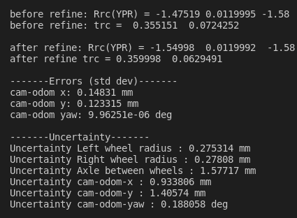

# 说明
该仓库代码主要借鉴使用了https://github.com/MegviiRobot/CamOdomCalibraTool的代码实现(非常感谢其实现)  
知乎相关文章https://zhuanlan.zhihu.com/p/101727151  
原先代码用于camera & 车轮计标定，代码做了删除和修改，现在用于IMU & 车轮计标定  
同时基于现代化的C++ code对原先代码格式和命名进行了修改
## 编译：
使用build.sh进行编译  
修改DBUILD_SHARED_LIBS参数来控制生成动态库和静态库，默认使用静态图
使用CMAKE_BUILD_TYPE参数来控制生成Release代码或者Debug代码
更详细的CMAKE使用方式请参考官网
## 使用：
完成上一步编译操作后，在当前代码目录下运行run.sh，可以看到类似如下输出   
和test_data/config_inner.yaml中的结果对比，相一致的话就是说明结果是符合预期的  
标定的数据格式请参考:  
test_data/formatted_camera.txt  
test_data/formatted_odometry.txt
## 细节
考虑到IMU和轮速计的数据收集过程中本身在时间上就很难做到完全对齐，此时引入时间偏移(delta_t)用于表示两者采集时间片之间的误差，使用test_data/generate_time_shift.py
脚本可以产生时间发生shift后的轮速计数据，通过循环标定新产生的轮速计数据和原先的IMU
数据，选取误差最小的结果作为最终两者之间的标定，相应的(delta t)即认为两者采集时间的偏差
## 状态：
开发中